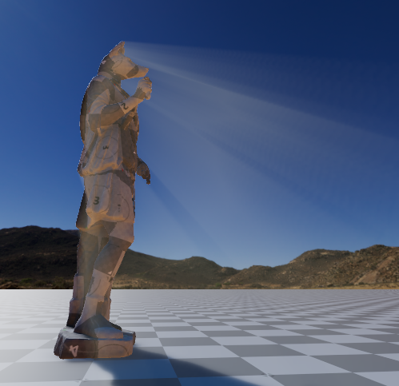

# GodRays

Screen-space light shafts for the Open 3D Engine (O3DE) Atom renderer.
The effect uses a localized depth mask, radial integration, depth-aware filtering,
and additive HDR compositing to create configurable rays around silhouettes.

*Demo screenshot provided by the author.*

## Features

- GodRays component with a directional editor indicator.
- Full, half, and quarter resolution ray buffers.
- Normalized integration with independent quality and intensity controls.
- Localized source mask, optional background glow, and a brightness cap.
- Smooth screen-edge fading and an optional GPU profiling API.
- One global console switch: `r_godRays`.

Add GodRays to the same entity as Directional Light. Rotation (+Y light
travel direction) controls the source and editor disk/arrow indicator; position
only places the indicator. Shadow maps are not required.

## Parameters

| Parameter | Default | Meaning |
| --- | --- | --- |
| Color | 1, 0.95, 0.85 | Linear RGB tint |
| Ray length | 0.85 | Fraction of the screen-space path towards the source |
| Falloff | 2 | Exponential attenuation over normalized path distance |
| Source radius | 0.35 | Local source mask radius, in screen heights |
| Source softness | 0.65 | Soft edge as a fraction of radius |
| Intensity | 0.15 | Linear multiplier of added HDR light |
| Max brightness | 0.25 | Cap on the largest added RGB channel, preserving hue |
| Background amount | 0 | 0 accents partial occlusion; 1 includes open-source glow |
| Screen edge fade | 0.3 | Offscreen fade distance, in screen heights |
| End fade start | 0.8 | Normalized distance where integration starts fading out |
| Filter strength | 0.65 | Reduced-buffer spatial filtering strength |
| Samples | 32 | 8–96 integration samples; quality independent of exposure |
| Resolution | Half | Full / Half / Quarter dimensions; composite is always full size |

For subtle silhouettes, leave Background amount at zero and adjust Intensity
first. Increase Source radius if the source mask does not reach the desired
silhouette; increase Ray length if the sampling path does not reach the source.
Increasing Samples improves integration quality but is not a brightness control.
Half dimensions mean one quarter of the pixels; Quarter means one sixteenth.

## Pipeline

The parent pass is inserted after opaque rendering and before transparent
objects and tone mapping. It owns four child passes:

1. **Mask:** four depth taps produce localized visible light and its unoccluded
   potential. Clear reverse-Z depth is sky. Depth is retained for reconstruction.
2. **Integrate:** midpoint samples integrate visible light and potential along
   the radial path. Distance-based exponential falloff and end fade are divided
   by total weight, so sample count does not scale brightness.
3. **Filter:** a 3x3 spatial filter rejects different depth surfaces, reducing
   low-resolution noise while retaining silhouettes.
4. **Composite:** four-tap depth-aware upsampling adds linear HDR light using
   One + One RGB blending, preserves scene alpha, and caps the added brightness.

Let L be integrated visible light and P its unoccluded potential.
The default artistic accent is L * saturate(4 * (1 - L / P)).
It vanishes on fully open paths and fully blocked paths, emphasizing partial
occlusion. Background amount blends this accent towards L. The brightness cap applies before tone mapping.

The first three buffers use transient RGBA16F images. Only the mask sets the
resolution scale; subsequent buffers inherit that size. There are no persistent
per-frame allocations, world-space marches or shadow-map lookups. Profiling
queries are off by default.

## License

[MIT](LICENSE).
